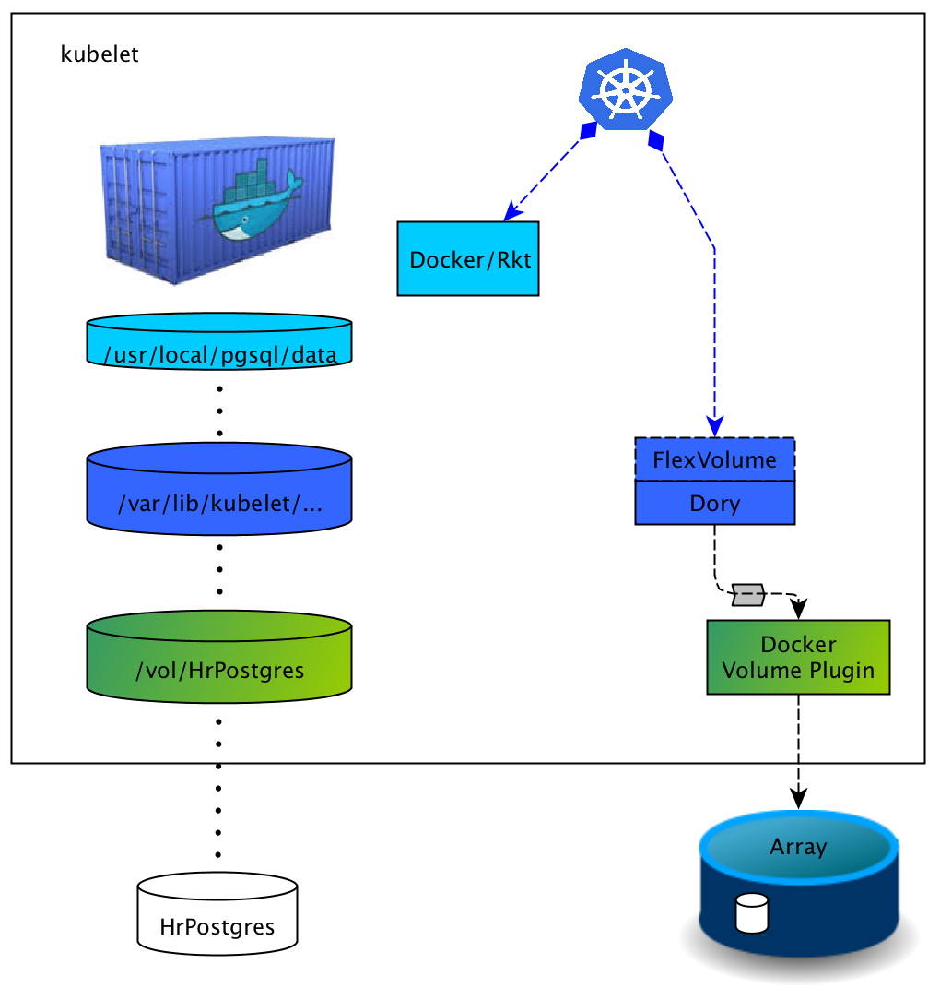
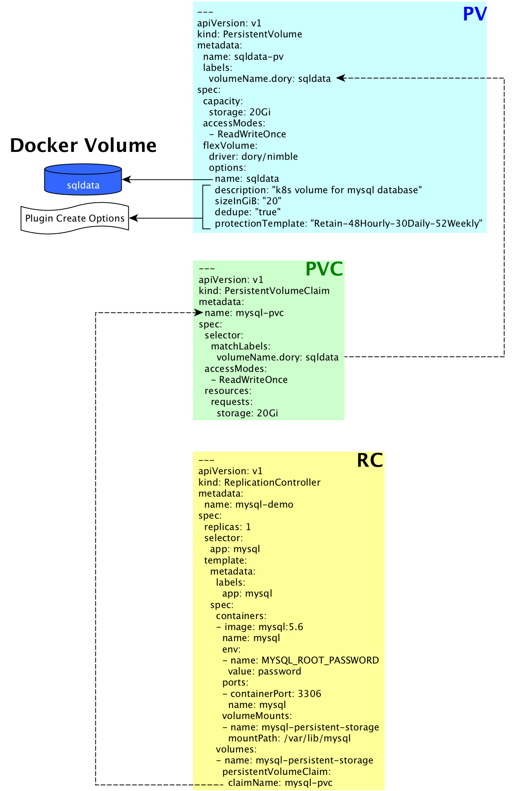

# Dory
Dory is a Kubernetes [FlexVolume Plugin driver](https://kubernetes.io/docs/concepts/storage/volumes/#out-of-tree-volume-plugins) that leverages the [Docker Volume API](https://docs.docker.com/engine/extend/plugins_volume/) and allows Kubernetes to leverage Docker Volume plugins, both [legacy](https://docs.docker.com/engine/extend/legacy_plugins/#volume-plugins) and [managed](https://store.docker.com/search?category=volume&q=&type=plugin). There is also an out-of-tree dynamic provisioner for Dory, called [Doryd](../doryd/README.md).

# Design
## Overview
In order to provide persistent storage for a Pod, Kubernetes makes a call to Dory via the Flexvolume interface. Dory is an executable placed in a specific directory (see [Installation](#installation)). Dory then communicates with the configured Docker Volume Plugin via a unix socket. Dory then translates the response from the Docker Volume Plugin to the Flexvolume interface. It is important to note that Dory never communicates with the container engine, it communicates directly with the Docker Volume Plugin. This theoretically allows Dory to work with any container engine supported by Kubernetes.

## Create
Dory is configured by default to create a volume if one with that name doesn't exist. It does this by first using the Docker Volume Plugin 'get' function. If this doesn't return a volume (and Dory is configured to create volumes), Dory will call the Docker Volume Plugin 'create' function using the options specified in the Persistent Volume definition. This is handled during the Attach workflow in Kubernetes 1.5 and in the Mount workflow in 1.6 and higher.

## Mount
The diagram below depicts the process communication on the right and the resulting objects on the left. When the Mount workflow is executed Dory first uses the Docker Volume Plugin 'get' function to see if the volume is available (see [Create](#create)). It then executes the Docker Volume Plugin 'mount' function to mount the filesystem. The Pod uuid is used as the Docker Volume Plugin 'mount id'. This results in the green cylinder labeled '/vol/HrPostgres' in the diagram. Dory then bind mounts the path returned by the Docker Volume Plugin to the location that Kubernetes has requested. This results in the dark blue cylinder in the diagram. If SELinux is configured on the kubelet Dory will set the proper context for this mount.



## Unmount
The unmount workflow unmounts the bind mount and then uses the Docker Volume Plugin 'unmount' function to unmount and detach the filesystem from the kubelet.

# Building
Dory is written in Go and requires golang on your machine. The current stable branch is release-1.0.  The following example installs the necessary tools and builds Dory on a RHEL 7.4 system:
```
sudo subscription-manager repos --enable=rhel-7-server-optional-rpms
sudo yum install -y golang make
git clone https://github.com/hpe-storage/dory.git
git checkout release-1.0
make gettools
make dory
```
You should end up with a `dory` executable in the `./bin` directory and be ready for [installation](#installation).

**Hint:** Go is available through the [EPEL](https://fedoraproject.org/wiki/EPEL) repository for .rpm based distributions and a `golang` package is part of the official Ubuntu repositories.

# Usage
## Installation
Create a directory on each kubelet with using the following convention: `/usr/libexec/kubernetes/kubelet-plugins/volume/exec/dory~plugin` where `plugin` is replaced with the name of the Docker Volume Plugin. Then copy the dory binary to this folder naming the file to the name of the Docker Volume Plugin. For example, in order to use [HPE's Nimble Storage Docker Volume Plugin](https://www.nimblestorage.com/docker/), the following directory should be created: `/usr/libexec/kubernetes/kubelet-plugins/volume/exec/dory~nimble`. The Dory binary should be copied to `/usr/libexec/kubernetes/kubelet-plugins/volume/exec/dory~nimble/nimble`.

## Configuration
Dory looks for a configuration file with the same name as the executable with a `.json` extension. Following the example above, the configuration file would be `/usr/libexec/kubernetes/kubelet-plugins/volume/exec/dory~nimble/nimble.json`.

### Docker Volume Plugin Socket Path
The critical attribute in this file is called `"dockerVolumePluginSocketPath"`.

In the case of a **version 1** [Docker Volume Plugin](https://docs.docker.com/engine/extend/legacy_plugins/), this is used to tell Dory where the socket file is located for the Docker Volume Plugin. Again, following the example above, the file would contain the following;
```
{
    "dockerVolumePluginSocketPath": "/run/docker/plugins/nimble.sock"
}
```

The attribute can also be used to describe a **version 2** [Docker Volume Plugin](https://store.docker.com/search?type=plugin). In this case, the name of the plugin used in place of the path to the socket file. The following example shows a plugin that has been aliased to 'nimble'. Note that version 2 support was added after release-1.
```
{
    "dockerVolumePluginSocketPath": "nimble:latest"
}
```

Prior to Kubernetes 1.8 FlexVolume drivers are not dynamically discovered and require a kubelet restart.

### Logging
There are two attributes which control how Dory logs. The `"logFilePath"` attribute provides the full path to the log file. The `"logDebug"` indicates whether to log at a debug granularity. The following are the default values;
```
{
...
    "logFilePath": "/var/log/dory.log",
    "logDebug": false
}
```

### Behavior
There are two attributes which control Dory's behavior. The `"createVolumes"` attribute indicates whether Dory should create a volume when it can't find one. The `"stripK8sFromOptions"` attribute indicates whether the options in the Kubernetes.io namespace should be passed on to the Docker Volume Driver. The following are the default values;
```
{
...
    "stripK8sFromOptions": true,
    "createVolumes": true
}
```

### Example
The following is an example of the default values;
```
{
    "dockerVolumePluginSocketPath": "/run/docker/plugins/nimble.sock",
    "logFilePath": "/var/log/dory.log",
    "logDebug": false,
    "stripK8sFromOptions": true,
    "createVolumes": true
}
```

## What's in a name?
There are several names that you should be aware of when using Dory. The first is the Docker Volume name. This is used by Dory to identify the Docker Volume that should be exposed to Kubernetes. The second name to be aware of is that of the Persistent Volume. This name is used by Kubernetes to identify the Persistent Volume object (for example, in the output of `kubectl get pv`). The final name to be aware of is that of the Persistent Volume Claim. This name is used to tie the claim to a Pod or Pod template.

Each of these names can be different. Some administrators follow a naming pattern in order to easily identify these relationships. For example, when using a Docker Volume named "sqldata" they might create a Persistent Volume named "sqldata-pv" and a Persistent Volume Claim named "sqldata-pvc". The Pod definition would then reference "sqldata-pvc".

Giving the Docker Volume, Persistent Volume and Persistent Volume Claim all different names is not required though. Because these are each different objects, they can all share the same name. This makes it even easier to identify the relationship between these objects.

**Note:** In Kubernetes 1.5 and 1.6 Flexvolume didn't provide the Persistent Volume name to its driver, so the Docker Volume name must be provided an an option in the Persistent Volume definition. As of 1.7 the Persistent Volume name is passed to the driver.

## Sometimes size does matter
Flexvolume currently doesn't communicate the size of the volume to its driver. If the Docker Volume Plugin you're using requires a size, you'll need to specify this in the options section of the Persistent Volumes.

### Example
This example uses the Docker Volume Driver from [HPE Nimble Storage](https://www.nimblestorage.com/docker/) to create a Persistent Volume to back a MySQL database instance. First, the administrator creates a Persistent Volume named "sqldata-pv". In order to be able to reference this Persistent Volume explicitly in the claim, the 'volumeName.dory' label is added. The options section may contain any create options the Docker Volume Driver supports. The administrator then creates a Persistent Volume Claim which uses a matchLabels selector to find the Persistent Volume. Finally, the administrator creates a Replication Controller that references the claim by name. When the Replication Controller is created, the Persistent Volume is matched with the Persistent Volume Claim and the Docker Volume is then created and then mounted.



# Future
Docker Volume plugins are beginning to surface for Windows Containers. Kubernetes is getting more mature for Windows. We hope to extend Dory to Windows in the future.

# Dynamic Provisioning
Dory has been extended with a dynamic StorageClass provisioner named [Doryd](../doryd/README.md). Doryd still depends on Dory for attach/detach and mount/unmount.

# Licensing
Dory is licensed under the Apache License, Version 2.0. Please see [LICENSE](../../LICENSE) for the full license text.
